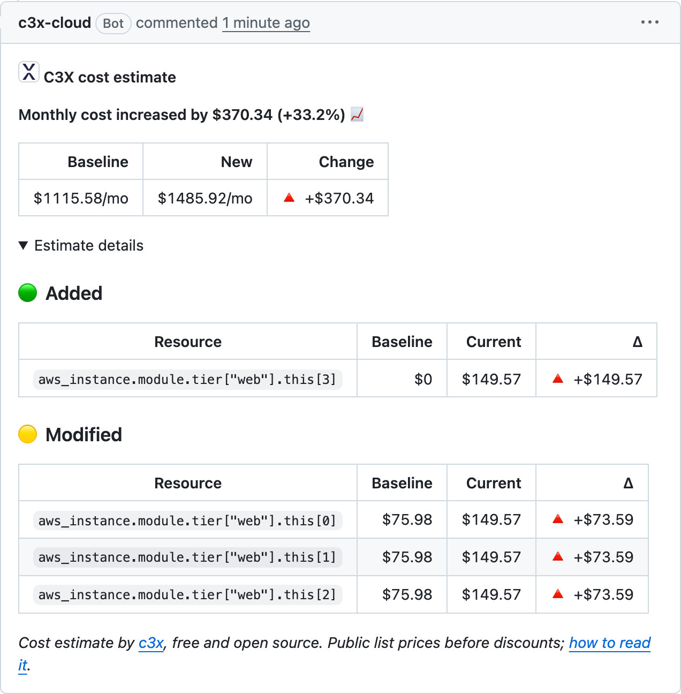

<div align="center">


# c3x demo

**See what a pull request costs before you merge it.**

Live examples of [c3x](https://github.com/c3xdev/c3x), the open source cost
estimator for Terraform, OpenTofu, Terragrunt and CloudFormation, running on
real pull requests.

[](https://github.com/marketplace/actions/c3x-cost-estimation)
[](https://github.com/c3xdev/c3x/releases)

[Documentation](https://c3x.dev/docs) · [CI/CD guide](https://c3x.dev/docs/ci-cd) ·
[c3x on GitHub](https://github.com/c3xdev/c3x) · [C3X Cloud app](https://github.com/apps/c3x-cloud)

</div>

<p align="center">
  <a href="https://github.com/c3xdev/c3x-demo/pull/11">
    
  </a>
</p>

## Live examples

Open pull requests in this repo, left open on purpose. Each one changes a
scenario and gets a cost comment from **c3x-cloud[bot]**.

| Pull request | Scenario | Cost change | What it shows |
|---|---|---:|---|
| [#11 Scale the web tier for launch](https://github.com/c3xdev/c3x-demo/pull/11) | aws | +$370.34/mo | An increase that passes the $500/mo `budget-delta` gate; added vs resized instances |
| [#12 Rightsize the database](https://github.com/c3xdev/c3x-demo/pull/12) | azure | −$368.18/mo | A cost decrease, priced in the resource group's region (`westeurope`) |
| [#13 Add a GPU training cluster](https://github.com/c3xdev/c3x-demo/pull/13) | aws | +$2,781.48/mo | ❌ The check **fails** on `budget-delta`, after the comment is posted |
| [#14 Scale Cloud Run and GKE for the holiday peak](https://github.com/c3xdev/c3x-demo/pull/14) | gcp | +$390.80/mo | Cloud Run minimum instances, GKE node pool, ⚠ caveats listed in the comment |
| [#15 Expand the edge API to Singapore](https://github.com/c3xdev/c3x-demo/pull/15) | opentofu | +$345.71/mo | OpenTofu provider `for_each`: a new region priced at its own rates |

## Add c3x to your repo in 60 seconds

Create `.github/workflows/c3x.yml`:

```yaml
name: Cost estimate
on: [pull_request]

permissions:
  contents: read
  pull-requests: write # post the comment
  id-token: write      # optional: comment as c3x-cloud[bot]

jobs:
  c3x:
    runs-on: ubuntu-latest
    steps:
      - uses: actions/checkout@v5
      - uses: c3xdev/c3x@v0
        with:
          path: .           # Terraform/OpenTofu directory, plan JSON or CloudFormation template
```

That's it: no API key, no account, no cloud credentials. On every pull
request c3x estimates the base branch and the PR branch and posts the
difference. `@v0` follows every c3x release.

Comments are posted as `github-actions` by default. Install the
[C3X Cloud app](https://github.com/apps/c3x-cloud) on the repository (and keep
`id-token: write`) to have them posted as **c3x-cloud[bot]**, as they are here.

Useful inputs:

| Input | What it does |
|---|---|
| `budget-delta: "500"` | Fail the check when the PR adds more than $500/mo |
| `budget: "5000"` | Fail the check when the monthly total goes above $5,000 |
| `strict: true` | Fail when any number rests on an assumption (⚠ caveat) |

The gates run before the comment step, so a failing gate in the same step
skips the comment. The [aws workflow](.github/workflows/aws.yml) posts the
comment in one step and enforces `budget-delta` in a second, so reviewers
always see the numbers.

Several directories on one PR? Give each run its own comment with
`C3X_COMMENT_TAG` (see the [workflows in this repo](.github/workflows)).

## Scenarios

One directory per scenario, each with its own workflow that runs only when
that directory changes. Totals are c3x's estimates at public on-demand list
prices, in USD unless noted.

| Directory | What's in it | What it shows | Monthly estimate |
|---|---|---|---:|
| [`aws/`](aws) | VPC over 3 AZs, NAT gateway per AZ, ALB, EC2 tiers, RDS PostgreSQL Multi-AZ, S3, Lambda | module `for_each`, `count` from `data.aws_availability_zones`, `dynamic` blocks, usage file, `.c3x.toml` budget, `budget-delta` gate | $1,115.58 |
| [`azure/`](azure) | AKS (Standard tier), Azure SQL `GP_Gen5_4`, GRS storage, Linux VM | location inherited from the resource group and priced in `westeurope` | $1,451.13 |
| [`gcp/`](gcp) | Cloud Run with warm instances, Cloud SQL HA, GKE, Compute Engine | zone → region pricing (`europe-west1-b`), Cloud Run minimum instances, ⚠ caveats | $1,341.10 ⚠ |
| [`opentofu/`](opentofu) | EC2 + ElastiCache in two regions, `.tofu` files | OpenTofu provider `for_each`, per-region prices | $597.59 |
| [`cloudformation/`](cloudformation) | EC2, RDS PostgreSQL, S3 | CloudFormation templates, `strict: true` | $362.79 |

⚠ The GCP estimate carries three caveats on purpose: c3x has no European
Cloud SQL price yet, so it quotes the `us-central1` rate and flags those
lines instead of hiding the gap. See [gcp/](gcp).

## Run it locally

```bash
brew install c3xdev/tap/c3x        # or: curl -fsSL https://c3x.dev/install.sh | sh
git clone https://github.com/c3xdev/c3x-demo && cd c3x-demo

c3x estimate --path aws                             # per-resource breakdown
c3x estimate --path azure --format json | jq .project_total
c3x estimate --path cloudformation/template.yaml
c3x estimate --path opentofu --currency EUR       # €526.27/mo
```

c3x reads the code statically: no `terraform init`, no providers, no
credentials. Prices come from [pricing.c3x.dev](https://pricing.c3x.dev).

## How much to trust the numbers

c3x prices at public on-demand list rates, before reserved instances,
savings plans, committed-use or negotiated discounts, so treat the totals
as an upper bound. Anything that depends on traffic (S3 requests, Lambda
invocations, NAT data, load balancer LCUs) comes from a
[usage file](aws/c3x-usage.yml); without one those lines are $0 and marked
⚠. More in the [docs](https://c3x.dev/docs).

## Links

- [c3x](https://github.com/c3xdev/c3x): source, releases, issue tracker
- [Documentation](https://c3x.dev/docs) and [CI/CD guide](https://c3x.dev/docs/ci-cd) (GitHub, GitLab, Bitbucket, Azure DevOps, Atlantis)
- [C3X Cost Estimation on the GitHub Marketplace](https://github.com/marketplace/actions/c3x-cost-estimation)
- [C3X Cloud GitHub App](https://github.com/apps/c3x-cloud)
